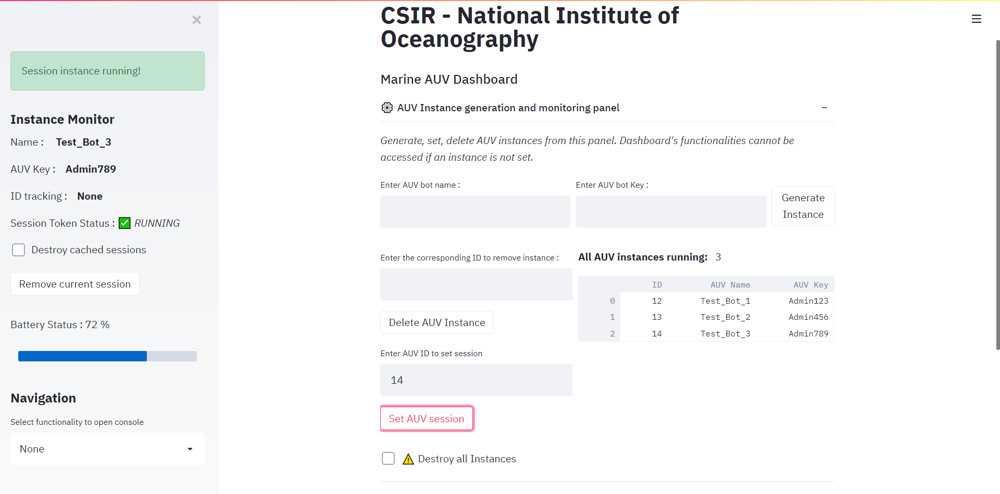

# NIO Dashboard v5.0

__Note :__ _The mapping functionalities and dynamic updates are still in work_

1. The 5.0 version has the capability to support and connect to multiple AUVs from a single dashboard panel. Once finished, it would be having the same functionalities as that of previous versions plus 1,2 additions.
2. It runs on streamlit v0.70.0 which unlike the v0.65.0 used in 4.0 is faster and provide better UI/UX and reduces number of code lines significantly.

## Instance and Session Manager

The AUVs are represented as instances whose name and key (can be any property unique to that AUV) could be hard-coded into it. The GUI, can be used to register that name and key into the server so that all the data related to each unique AUV instance could be stored and retrieved correctly. The relational database is as follows:

The database schema can be found [here](https://dbdiagram.io/d/5fa93c393a78976d7b7b1d16)

The setting up of instances into the server is done using an instance manager panel, where the user can add or remove or delete all instances of AUVs. Connecting to a particular AUV instance is done using a session manager.

The session and instance manager are stored in cookie manner, not in browser but in a sqlite database, making them non-volatile. Once a correct instance has been generated and connected to a correct session, all data corresponding to it will be visible.

## Mapping Functionalities

This feature is yet to be integrated here and would be done soon.

## Mission File Upload

The mission upload differs in 5.0 than it was in 4.0 in the manner that it now supports mission compiling at the GUI level itself rather than at the AUV side. The mission file compiler, cmpiles the mission.txt file to gather the required data from it, converts it into JSON format and stores it in the server in string format.

1. The mission file compiler can also raise error if the mission.txt file was not in correct format.
2. The data from the mission file could be retrieved at the AUV side in dictionary format by running the command `JSON.loads(data)`

## On board Camera stream

No major changes have been done to this functionality and thus follows the similar codebase as 4.0 had.

Follow the given steps to use this feature in the dashboard:

1. Install __IP Webcam__ application on your external device.
2. Make sure that the external device and the machine on which the GUI is running is in same network.
3. Open the IP Webcam application and at the bottom, click on __Start Server__.
4. Copy/Note down the IPv4 address that is given on the screen when the server starts and enter it into the GUI camera stream field.
5. Clicking on __Generate Stream__ will display the live feed from the external device onto a new window. The new window can only be closed if the application is stopped running from the external device from which it is transmitting.

___Note___: Once closing the IP Webcam server, reload the GUI or try running it again if it hangs up.

## Setting up the Server

The steps are the same as that followed in v4.0

1. Go to [this link](https://www.apachefriends.org/download.html) to install XAMPP.
2. After downloading XAMPP, open the application. It should be in C:/xampp/xampp-control.exe
3. In the control pannel that opens up, click on the `Apache` and `MySQL` start button. It will start running once the text on the dashboard turns to green.
4. In your browser, open [localhost/phpmyadmin/](http://localhost/phpmyadmin/). It will open up a MySQL dashboard.
5. Go to _New/Create Database/_
6. Give the Database name as - `nio_server`. Click on **Create** to continue.
7. In the **nio_server** panel, click on **Import**.
8. Choose the `nio_server.sql` file from [Extra/Database/nio_server.sql](Extra/Database/nio_server.sql) and click **Go**.

## Setting up the Application

The v5.0 runs on Python v3.8. To run the application, open command line in _root_directory/5.0/App/_. It is assumed, you have Pipenv instaleld. If not, run - `pip install pipenv`. 

1. In the commandline, run the following commands - 

    $ pipenv shell  
    $ pipenv install

2. This will install all the necessary libararies required to run this GUI. If you are facing any problem installing it using this, install it manually using `pipenv install` in the same directory. The required libraries are specified in _App/Pipfile_ . 
3. Once everything is set up, run the following command to start the GUI. It will automatically open up in a browser and also give the local and network URL on which it is running.

    $ streamlit run app.py

## Work Left

1. Add offline mapping feature.