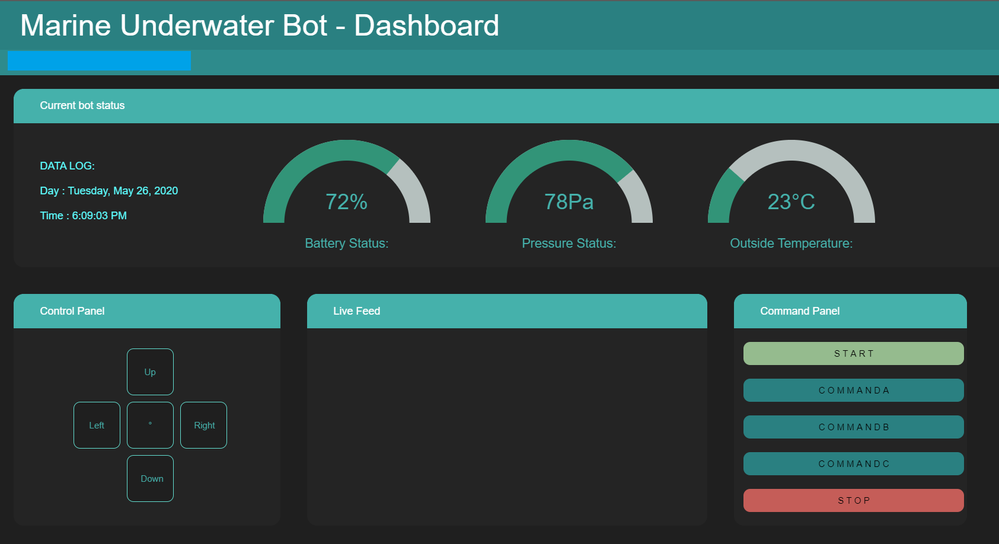
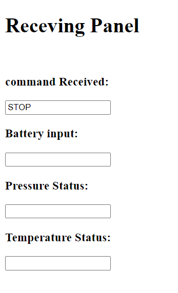

# Dashboard for relaying commands to another IP and getting response in realtime

The dashboard can send commands to the receiving pannel which get's updated in realtime. In same manner commands entered via the receive pannel updates values on dashboard in realtime. All this is done via AJAX, PHP and JQuery. The database used is MySQL and for testing runs on Apache server.


This is how the dashboard looks. The commands can be specified later for various use. Gauges are updated by the data sent from the receive panel in realtime.


This is a temporary page made so as to immitate the receiver side. Can later be replaced by a practical model. This is for representation purposes.

## Server settings

Follow the steps below to set up the files on apache server:

1. Download and install XAMPP server
2. Set up virtual host on port 5000.Go to xampp/apache/conf/extra/httpd-vhosts.conf and add the following code:
    ```
        <VirtualHost *:5000>
        ServerAdmin webmaster@localhost.com
        DocumentRoot "C:\xampp\htdocs\local.pos.com"
        ServerName local.pos.com
        </VirtualHost>
    ```
    This is where the receive page would be hosted
3. On the XAMPP control panel, go to settings for apache and open httpd.conf file and insert following below Listen :80
    ```
        Listen :5000
    ```
4. The server setting is done now. Make sure the file NIO and local.pos.com are in xampp/htdocs.
5. The dashboard now runs on ```http://localhost:80/NIO/index.html``` and receive panel on ```http://local.pos.com:5000/index.html```.

## Database settings

The databse used here is MySQL so have to set it up as the servers would do CRUD operations onto it. Follow the steps to set it up:

1. Create a new databse command_log in MySQL. This is the primary database.
2. Create Table log with columns [id] and [cmd]. Give PRIMARY KEY and AUTO_INCREAMENT to id and NOT NULL to cmd. This table will store values that the user executes on the Dashboard and update it on the receiving panel.
3. Create Table batteryupdate/pressureupdate/temperatureupdate with columns [id] for all and [percent]/[pascal]/[kelvin] respectively. Set the properties as the same as above except that percent, pascal and kelvin do not have property NOT NULL. These values shall be used to update the gauges in the dashboard.

## Finishing

Everything's setup now. On the XAMPP dashboard, start the Apache server and MySQL database and your dashboard and receiving pannel should be running and should be updated in realtime. The lag I've set here is max 1s. You can lower it according to your choice by updating the setInterval property from 1000 to interval of your choice.

NOTE: This is a very basic attempt at having a two way conversation between webpages on different port and there are different methods which could speed and/or simplify the process. 
