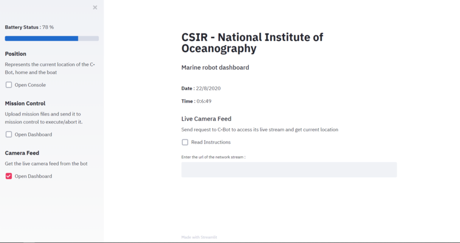
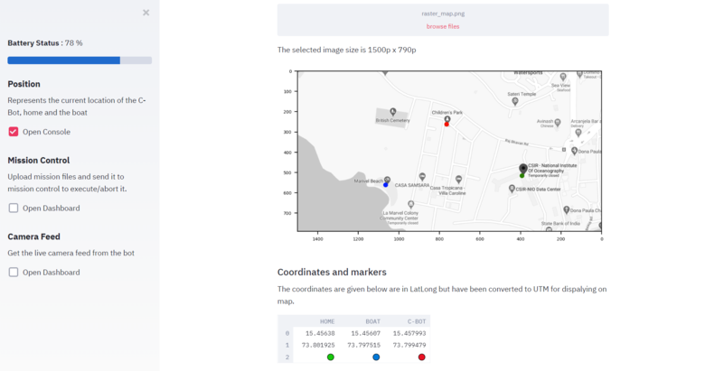
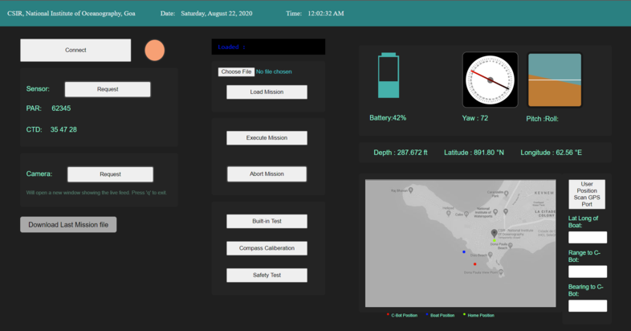
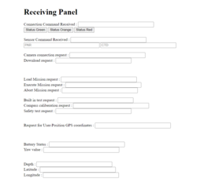

# Working Dashboard Example

Used jQuery and Ajax scripts to send and receive data from MySQL database. PHP as server side script and HTML/CSS/JS for interface. The dashboard would be uploaded and run on an embedded system.  
**Note:** The latest version has been written in python.

1. Can perform basic CRUD operations on files which can be added locally onto server.
2. Can send and receive updates to and fro from the dashboard and the receiving panel.
3. Has capabilities of working offline. (even the maps but with reduced functionalities)
4. Has ability to provide live streaming videos. (v4.0 only)
5. Work done in version wise.

  

  
The latest 4.0 version with improved UI for offline imaging and video streaming

  

# Latest Release - v4.0:
1. Takes up less memory for operating but uses quite a few python libraries which might take up space.
2. Which python modules to be imported in the requirements.txt file
3. Comes with both offline and online map. Online map provides more interactiviy while the offline one is static with just the raster tile of the place that is specified.
4. Now has facilities for live streaming video onto dashboard.
5. Offline map uses text files for anchoring and an image tile to rasterize it and create a virtual vector mapping.

  

  
Onffline mapping in v4.0

  

# Database:
1. A copy of the databse (9/7/2020 - latest) is there in the folder 3.0
2. Copy is in CSV,JSON and SQL (will work with mySQL only)
3. The copy database is compatible with v3.0 . Might be unstable with former versions.

  

# Usability:
1. for versions 1.0 to 3.0 has a dashboard and a pannel. The pannel can be assumed to the server side which can send the data (in this case, you can manully send data to the dashboard and see it get updated in realtime).
2. The 4.0 version only has one app.py file which runs everything. The server side has not been made here as data can easily transfered to it since the boilerplate has been written in python. To run it, go to the directory where app.py is located in 4.0. Open the command line and type `streamlit run app.py`

  

  
The latest build of Dashboard working on HTML/CSS/JS/PHP i.e v3.0

  

# About the versions:
1. 1.0 gives the very basic dashboard where the only functionality is that the receiving panel sends inputs to the dashboard. The communication is 1-way. Mainly made for designing the template
2. 2.0 comes with the addition of extra commands. The user sends commands from dashboard and it get's received in the receiving panel. The communication is 2-ways. Complete dashboard design inducted.
3. 3.0 has the ability to interract with the local system as well. User can upload files to it which it can run (currently python only). The result is stored onto a databse. It also has offline map compability.
4. 4.0 is the dashboard made with python (streamlit). It has no affiliation with the databases unlike the other versions. Has all the functionalities as that of v3.0. Recomended for scaling-up purposes. More information about this version is given in the README in the folder 4.0
5. Corrupt version (in folder Extra) works on version 2.0 and has it's capabilities. Not suitable tho as files are not organized efficiently.

  

  
The builds before 4.0 have a receiving pannel with them to simulate the realtime functionalities of the dashboard and perform to and fro communications

  

__A few details:__
1. The result is stored in run_mission table
2. The files are uploaded in the UPLOAD folder, their path is stored in mission_file.
3. Abort mission deletes the file from the UPLOAD folder as well as it's path from the mission_file table.
4. Even after aborting mission, the one which was uploaded immediately before that could be downloaded from the Download last mission button.
5. Rest all tables are not involved with the user side as are used to store commands received to/from the dashboard/panel.
6. The offline map works on the basis of rasterizing an image tile and plotting onto it. Hence would be static and won't provide any zooming capabilities.
7. Since the v4.0 is still in build, the folder workspace is a trial playground and hence won't affect the performance od dashboard.

  

# Upcomming updates

Will be integrating external executionary unit; Terminal.exe to get position of bot in realtime using live GPS. Currently maps cannot be updated in realtime to show position and does not show history of previous command/locations; all of which would be a feature of 5.0. It will also include an error-logging system to show and log realtime commands and traceback errors for better debugging experience.

__Note__: After the image calling system for live stream videos for v3.0, the javascript build would be discontinued. All successive builds would take place on top of v4.0 only.