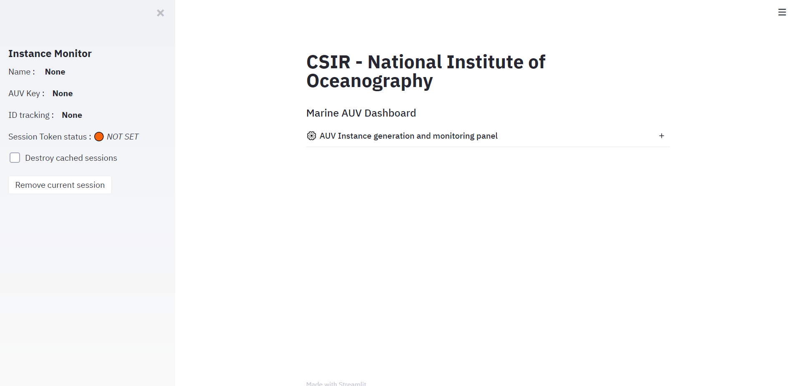
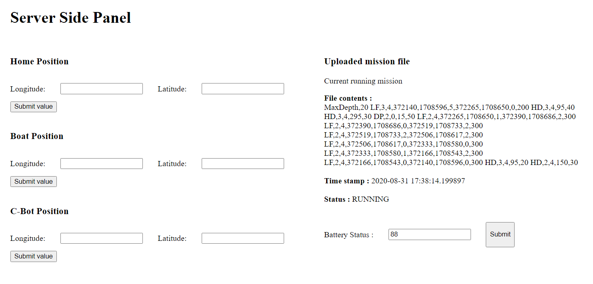

# Working Dashboard Example

Used jQuery and Ajax scripts to send and receive data from MySQL database. PHP as server side script and HTML/CSS/JS for interface. The dashboard would be uploaded and run on an embedded system.  
**Note:** The latest version has been written in python.

1. Can perform basic CRUD operations on files which can be added locally onto server.
2. Can send and receive updates to and fro from the dashboard and the receiving panel.
3. Has capabilities of working offline. (even the maps but with reduced functionalities)
4. Has ability to provide live streaming videos. (v4.0 and above only)
5. Work done in version wise.

  
The latest 5.0 version with improved UI for offline imaging and video streaming

## Latest Release - v5.0:

1. Supports handling and connecting of multiple AUV instances to GUI.
2. Compiling mission file before uploading to server.
3. Facilities for live onboard camera feed.
4. Dynamic updates and mapping features still in work.

## Steady Build - v4.0:

1. Supports online and offline mapping functionality.
2. Can dynamically update values.
3. Live camera feed functionality.

  
Onffline mapping in v4.0

## Database:

### Current Database Schema

This schema supports the v4.0 and 5.0 which works on python.

1. The database schema for v4.0 and 5.0 are available in their _Extra/Database/_ folders.
2. The database files are in .sql format but will only be supported by __phpmyadmin__, which would be installed while installing XAMPP (read more about this in the README of v4.0 and v5.0)

### Older Database Schema

The .sql file can only work with __phpmyadmin__. The schema here is used for v3.0 which runs on traditional HTML/CSS/JS.

1. A copy of the databse (9/7/2020) is there in the folder 3.0
2. Copy is in CSV,JSON and SQL (will work with mySQL only)
3. The copy database is compatible with v3.0 . Might be unstable with former versions.

## Usability

1. for versions 1.0 to 3.0 has a dashboard and a pannel. The pannel can be assumed to the server side which can send the data (in this case, you can manully send data to the dashboard and see it get updated in realtime).
2. The 5.0 and 4.0 version only has one app.py file which runs everything. The server side has not been made here as data can easily transfered to it since the boilerplate has been written in python. To run it, go to the directory where app.py is located in _4.0/APP/_ and _5.0/App/_ respectively. Open the command line and type `streamlit run app.py` after going through the setup in their README.

  
The latest build of Dashboard working on HTML/CSS/JS/PHP i.e v3.0

## About the versions

1. 1.0 gives the very basic dashboard where the only functionality is that the receiving panel sends inputs to the dashboard. The communication is 1-way. Mainly made for designing the template
2. 2.0 comes with the addition of extra commands. The user sends commands from dashboard and it get's received in the receiving panel. The communication is 2-ways. Complete dashboard design inducted.
3. 3.0 has the ability to interract with the local system as well. User can upload files to it which it can run (currently python only). The result is stored onto a databse. It also has offline map compability.
4. 4.0 is the dashboard made with python (streamlit). It has no affiliation with the databases unlike the other versions. Has all the functionalities as that of v3.0. Recomended for scaling-up purposes. More information about this version is given in the README in the folder 4.0
5. 5.0 currently is in production and thus 4.0 is the stable build. But once completed will have all the functionalities of 4.0 and offer support for managing multiple AUVs.

___Note:___ Corrupt version (in folder Extra) works on version 2.0 and has it's capabilities. Not suitable tho as files are not organized efficiently.

 

The builds (except 5.0 currently) have a server side panel to stimulate the realtime functionalities of the dashboard and thus perform to and fro communications. This one is that of the v4.0.

### A few details about stable build 4.0

1. The result is stored in run_mission table
2. The files are uploaded in the UPLOAD folder, their path is stored in mission_file.
3. Abort mission deletes the file from the UPLOAD folder as well as it's path from the mission_file table.
4. Even after aborting mission, the one which was uploaded immediately before that could be downloaded from the Download last mission button.
5. Rest all tables are not involved with the user side as are used to store commands received to/from the dashboard/panel.
6. The offline map works on the basis of rasterizing an image tile and plotting onto it. Hence would be static and won't provide any zooming capabilities. However it would be updated dynamically with a latancy of 2 seconds.

## Upcomming updates

Integrating the dynamic updates and mapping functionality within the v5.0. Version 4.0 is stable and ready to use for one-to-one control of GUI and AUV instance. v5.0 will allow support for one-to-many GUI to AUV instances.

__Note__: After the image calling system for live stream videos for v3.0, the javascript build would be discontinued. All successive builds would take place on top of v4.0 only.